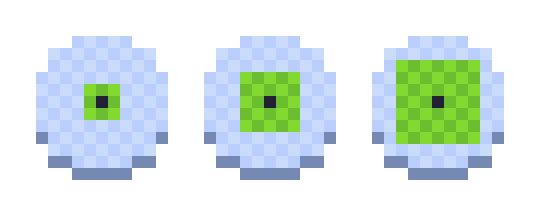
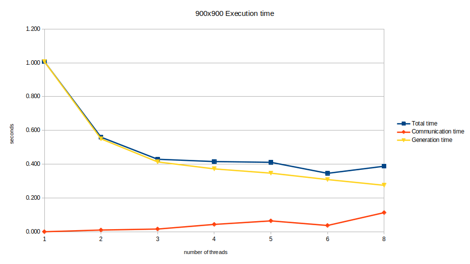
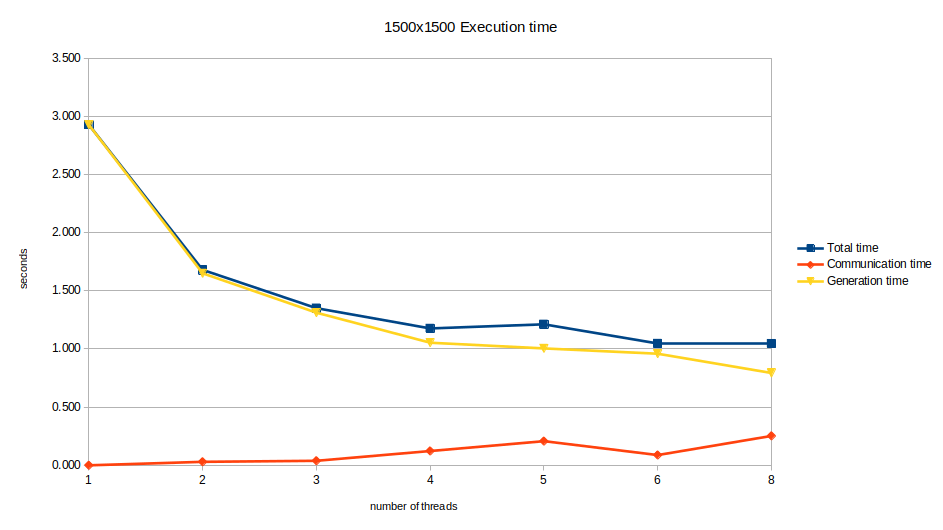
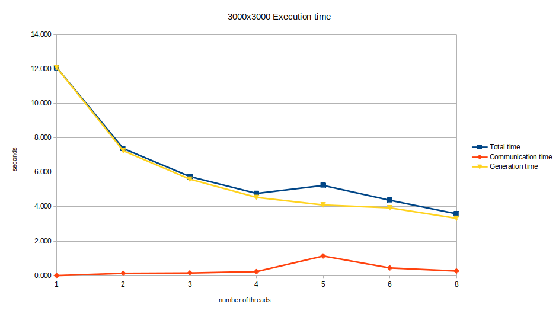
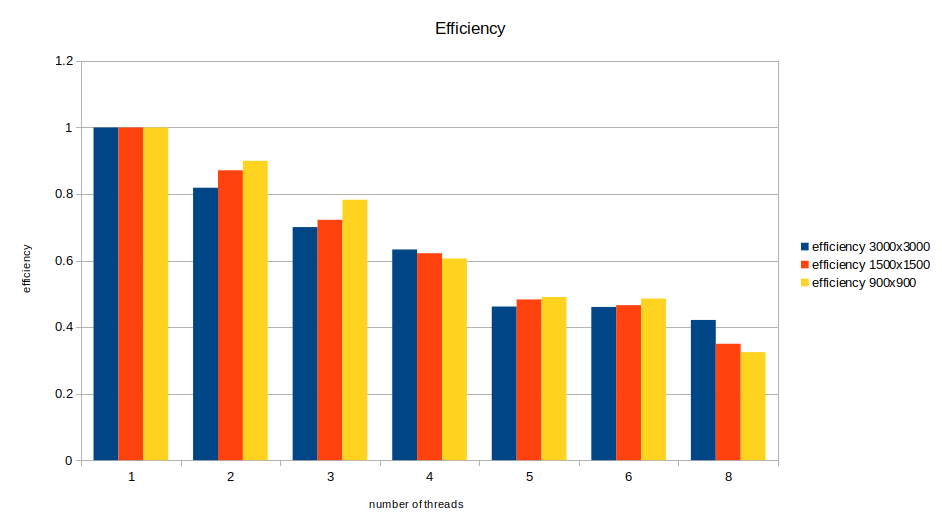

# Relazione progetto esame Algoritmi paralleli e sistemi distribuiti


## Alessio Farfaglia

[TOC]

## Introduzione

Mentre l'idea di fare un Automa cellulare che generasse una caverna mi è venuta da questo [video youtube](https://youtu.be/v7yyZZjF1z4), l'implementazione è del tutto personale.


## Progettazione Concettuale

L'esecuzione del programma può essere suddiviso in queste parti:

1. si carica la configurazione scelta dall'utente tramite file e/o argomenti
2. si crea una griglia di `cols` colonne e `rows` righe
3. si riempie pseudo-casualmente la griglia di  `0` o  `1`  *(in base se il numero generato supera una soglia impostata dall'utente)*
4. se si usano più thread, il **main-thread suddivide staticamente la griglia in delle sotto-griglie e le distribuisce**
5. *inizia il loop principale*
6. **si scambino le celle-halo** tra i thread vicini
7. per ogni cella della sotto-griglia si contano i vicini vivi e:
   1. se sono maggiori o uguali alla soglia superiore la cella diventa piena (`1`)
   2. se sono inferiori alla soglia inferiore la cella diventa vuota (`0`)
   3. altrimenti la cella resta invariata (`1` o `0`)
8. il **main-thread raccoglie tutte le sotto-griglie**
9. viene mostrata la gliglia intera
10. se non si è raggiunta la generazione finale **si torna al punto 6**
11. *finisce il loop principale*
12. si mostrano informazioni sull'esecuzione
13. *il programma termina*

## Funzione di transizione

La funzione di transizione di questo automa pur non essendo particolarmente complessa, da vita a formazioni che ricordano quelle di una caverna.

la versione di base fa questo:

1. la cella conta le celle piene tra i suoi **8 vicini** ([vicinato di Moore](https://en.wikipedia.org/wiki/Moore_neighborhood))
2. se sono **più di 4**, la cella diventa **piena** (`1`)
3. se sono **meno di 4**, la cella diventa **vuota** (`0`)
4. altrimenti la cella resta invariata

Nel mio programma ho voluto mantenere il funzionamento di base, ma estendendolo a un raggio arbitrario, in particolare:

- nella versione di base 4 indica sia la metà del numero di vicini sia la soglia da superare per cambiare lo stato della cella

- nella mia versione la soglia è data dalla metà del numero dei vicini + la variabile `roughness`. (chiamata così perché all'aumentare di essa, la superficie della caverna diventa più frastagliata)

- il numero totale di vicini è dato dal raggio, la formula esatta è:  $vicini = (raggio * (raggio+1)) * 4$, ma è molto più intuitivo graficamente:

- da sinistra verso destra: raggio 1, raggio 2 e raggio 3

  

altre caratteristiche:

- la griglia non è toroidale, le celle al di fuori della griglia si possono considerare piene, questo genera delle caverne sempre chiuse.
- si utilizzano 2 griglie (*read* e *write*)
  - lo stato di write è determinato dalla griglia read
  - una volta terminata la generazione, *write* diventa *read*

## Implementazione versione seriale

Si è voluto iniziare da una semplice versione seriale, qui ho implementato (dopo qualche difficoltà iniziale) un sistema di rendering sfruttando la libreria [allegro 5](https://liballeg.org/) e una prima versione di base del loop principale.

A questo punto tenendo in considerazione la questione performance ho preso la decisione di sfruttare il pre-processore di c per compilare solo la parte che mi interessava, in particolare se l'esecuzione fosse seriale o parallela e se mostrare la griglia oppure no.

Andando avanti con lo sviluppo questa decisione ha portato pochi pro e molti contro (codice difficile da gestire), quindi ho deciso di semplificare le cose utilizzando dei semplici `if`, a conti fatti l'impatto sulle prestazioni è stato impercettibile.

 Ogni cella quando deve contare i vicini pieni lo fa sfruttando quella che è la griglia di lettura, dopo di che lo stato della cella viene scritto sulla griglia di scrittura.

Quando tutte le celle hanno finito di aggiornarsi le griglie si scambiano di ruolo, quella di scrittura diventa di lettura e pronta per essere renderizzata, mentre quella di lettura diventa di scrittura, pronta per ospitare lo stato delle celle della prossima generazione.

## Parallelizzazione

Fin da subito implementare la parallelizzazione si è rivelato alquanto difficoltoso, mentre prima il processo era semplice

- aggiornare tutte le celle 
- mostrare la griglia aggiornata
- ripetere

Ora c'era il bisogno di suddivisione del carico di lavoro e comunicazione tra i threads:

- suddividere e inviare la griglia iniziale in diverse sotto-griglie
- inviare le celle-halo ai thread vicini
- ricevere le celle-halo dai thread vicini
- aggiornare le celle della propria sotto-griglia
- inviare le sotto-griglie e ricostruire la griglia totale nel main-thread
- mostrare la griglia aggiornata 

Come se non bastasse, ho voluto optare per una suddivisione a griglia in 2 dimensioni, questo ha complicato ulteriormente le cose, visto che in base alla posizione relativa con un altro thread, il tipo di comunicazione può variare.

#### Definizioni

Per comprendere meglio alcune delle implementazioni a venire va spiegato cosa significano queste variabili, (si tenga in mente che dove c'è scritto `rows` *(righe)* esiste una controparte per le `cols` *(colonne)*) :

```cpp
tot_inner_rows 	// righe della griglia totale senza contare i bordi esterni
my_rows 		// righe della sotto-griglia con l'aggiunta delle celle-halo 
my_inner_rows  	// righe della sotto-griglia senza l'aggiunta delle celle-halo
inner_grid_size // numero di elementi all'interno della sotto-griglia senza celle-halo
outer_grid_size // numero di elementi all'interno della sotto-griglia 
```

### MPI Datatypes

Ho creato in totale 5 tipi di dato su misura: 

```cpp

// inner_grid_t è come i vari thread gestiscono la propria sotto-griglia
// ma quando si comunica con il main-thread, esso vuole riceverla come un blocco contiguo in memoria
// infatti questi 2 datatype hanno lo stesso numero di elementi al suo interno, ma disposti in modo diverso
// ecco perchè dell'utilizzo di 2 data types
MPI_Datatype inner_grid_t;		// tiene in considerazione le celle halo
MPI_Datatype contiguous_grid_t; 

MPI_Datatype column_t; 	// utilizzato per inviare e ricevere le celle-halo a destra e sinistra 
MPI_Datatype row_t; 	// utilizzato per inviare e ricevere le celle-halo sopra e sotto 
MPI_Datatype corner_t; 	// utilizzato per inviare e ricevere le celle-halo agli angoli

. . .

const int outer_sizes[] = { my_rows, my_cols };				// dimensione totale della sotto-griglia
const int inner_sizes[] = { my_inner_rows, my_inner_cols }; // dimensione della sotto-griglia senza celle-halo
const int starts[] = { 0, 0 };								// iniziamo da (0, 0) per semplificare i calcoli
MPI_Type_create_subarray(2, outer_sizes, inner_sizes, starts, MPI_ORDER_C, MPI_UINT8_T, &inner_grid_t);

MPI_Type_contiguous(inner_grid_size, MPI_UINT8_T, &contiguous_grid_t);

MPI_Type_vector(my_inner_rows, radius, my_cols, MPI_UINT8_T, &column_t);
MPI_Type_vector(radius, my_inner_cols, my_cols, MPI_UINT8_T, &row_t);
MPI_Type_vector(radius, radius, my_cols, MPI_UINT8_T, &corner_t);

. . .

```

è stato necessario creare 2 datatypes per la griglia perché il main thread gestisce la griglia intera diversamente dalle sotto-griglie.

Infatti per mostrare le celle all'utente bisogna avere una matrice con esattamente  `tot_inner_rows` righe e `tot_inner_cols` colonne.

c'è stato anche bisogno di 3 tipi per le comunicazioni riguardanti le celle halo, in base alla posizione relativa dei thread.

### MPI Communicator

Per simulare la posizione relativa tra i thread ho usato un comunicatore apposito `cave_comm`:

```cpp
int dims[2] = { cfg->y_threads, cfg->x_threads };
int periods[2] = { 0, 0 };
MPI_Cart_create(MPI_COMM_WORLD, 2, dims, periods, 0, &cave_comm);
```

in questo modo è stato relativamente facile conoscere per esempio chi fosse il thread in alto a destra rispetto a questo thread, facilitando le comunicazioni con i thread vicini.

### Suddivisione Griglia

Come accennato prima il main-thread genera l'intera griglia in modo pseudo-casuale partendo da un seed,  una volta generata, la suddivide in blocchi di uguale grandezza e li invia a tutti i thread, se stesso compreso.

```cpp
void scatter_initial_grid() {
	// il root suddivide la griglia iniziale per tutti i processi (se stesso incluso)
	uint8_t* dest_buff = &read_grid[(my_cols * radius) + radius];
	MPI_Scatter(root_grid, 1, contiguous_grid_t, dest_buff, 1, inner_grid_t, ROOT_RANK, cave_comm);
}
```

Qui sorge un problema:

il main-thread crea e gestisce la matrice come una griglia contigua di valori, utilizzando lo spazio necessario per immagazzinare essi.

I vari thread quando devono aggiornare le celle lungo i bordi hanno bisogno di informazioni sullo stato di celle che loro non andranno a modificare, in particolare se sono celle esterne alla griglia, queste possono sempre essere considerate piene, ma per le celle gestite da un altro thread c'è bisogno di comunicazione tra i due.
Qui entrano in gioco i 3 tipi definiti prima: `column_t`, `row_t`, `corner_t`.

per esempio l'invio delle colonne funziona così:

```cpp
void send_columns() {
	if(neighbours_ranks[MIDDLE][LEFT] != MPI_PROC_NULL) {
		MPI_Request req;
		int start_idx = my_cols * radius + radius;
		MPI_Isend(&read_grid[start_idx], 1, column_t, neighbours_ranks[MIDDLE][LEFT], 1001, cave_comm, &req);
		MPI_Request_free(&req);
	}

	if(neighbours_ranks[MIDDLE][RIGHT] != MPI_PROC_NULL) {
		MPI_Request req;
		int start_idx = my_cols * radius + my_inner_cols;
		MPI_Isend(&read_grid[start_idx], 1, column_t, neighbours_ranks[MIDDLE][RIGHT], 1002, cave_comm, &req);
		MPI_Request_free(&req);
	}
}
```


### Rendering

Quando tutti i thread hanno finito di aggiornare la propria parte di griglia sorge il problema del rendering, allegro non da la possibilità di modificare la grafica da più thread, quindi c'è il bisogno di raggruppare nuovamente tutte le sotto-griglie nel main-thread, così da poter gestire la grafica da un solo thread.

MPI ci da a disposizione una funzione che fa esattamente questo.

si noti come si passa dal tipo `inner_grid_t` a `contiguous_grid_t`

```cpp
void gather_grid() {
	uint8_t* send_buff = &read_grid[(my_cols * radius) + radius];
	MPI_Gather(send_buff, 1, inner_grid_t, root_grid, 1, contiguous_grid_t, ROOT_RANK, cave_comm);
}
```

al termine, il main-thread si ritroverà su `root_grid` tutte le sotto-griglie in modo contiguo, senza celle-halo di troppo e pronto per essere mostrato all'utente.

## Risultati benchmark

Hardware utilizato: HP PROBOOK 430 G8 

- CPU: 11th gen Intel® Core™ i7-1165G7 @ 2.80GHz (4 processori fisici, 8 processori logici)
- GPU: (integrata) Intel iris xe graphics

- RAM: **16 GB** ‎DDR4 SDRAM  ‎3200 MHz 

Usando la grafica il tempo di esecuzione è determinato principalmente dal tempo di rendering (90%+).

Questo tempo è difficilmente parallelizabile senza una GPU, quindi ho preso la decisione di concentrare i benchmark sul programma utilizzato senza rendering.

- ho considerato 3 griglie di dimensione diverse (900x900), (1500x1500) e (3000x3000).
- tutte le varie combinazioni possibili con 8 processori, che dividano la gliglia in parti intere uguali.
  esempio: (1, 1), (1, 2), (2, 1), (1, 3) ... (1, 6), (2, 3) ... (1, 8) 

- Il raggio è sempre di 2, e la variabile `roughness` è sempre 2.

- Il seed è sempre lo stesso, ho scelto a caso il numero `787878`

#### Tempo di esecuzione griglia 900x900



| numero threads | Tempo totale | Tempo comunicazione | Tempo generazione |
| :------------: | :----------: | :-----------------: | :---------------: |
|       1        |    1.007     |        0.000        |       1.007       |
|       2        |    0.559     |        0.010        |       0.549       |
|       3        |    0.428     |        0.015        |       0.413       |
|       4        |    0.415     |        0.043        |       0.371       |
|       5        |    0.410     |        0.064        |       0.346       |
|       6        |    0.345     |        0.036        |       0.308       |
|       8        |    0.387     |        0.113        |       0.274       |


#### Tempo di esecuzione griglia 1500x1500



| numero threads | Tempo totale | Tempo comunicazione | Tempo generazione |
| :------------: | :----------: | :-----------------: | :---------------: |
|       1        |    2.927     |        0.000        |       2.927       |
|       2        |    1.679     |        0.030        |       1.650       |
|       3        |    1.350     |        0.039        |       1.311       |
|       4        |    1.176     |        0.123        |       1.053       |
|       5        |    1.212     |        0.207        |       1.004       |
|       6        |    1.047     |        0.088        |       0.959       |
|       8        |    1.045     |        0.253        |       0.793       |


#### Tempo di esecuzione griglia 3000x3000




| numero threads | Tempo totale | Tempo comunicazione | Tempo generazione |
| :------------: | :----------: | :-----------------: | :---------------: |
|       1        |    12.089    |        0.000        |      12.089       |
|       2        |    7.381     |        0.130        |       7.251       |
|       3        |    5.751     |        0.150        |       5.601       |
|       4        |    4.771     |        0.231        |       4.540       |
|       5        |    5.237     |        1.135        |       4.101       |
|       6        |    4.375     |        0.440        |       3.934       |
|       8        |    3.585     |        0.262        |       3.323       |


#### Efficienza 





| numero threads | efficienza 3000x3000 | efficienza 1500x1500 | efficienza 900x900 |
| :------------: | :------------------: | :------------------: | :----------------: |
|       1        |        1.000         |        1.000         |       1.000        |
|       2        |        0.818         |        0.871         |       0.900        |
|       3        |        0.701         |        0.722         |       0.782        |
|       4        |        0.633         |        0.622         |       0.606        |
|       5        |        0.461         |        0.483         |       0.490        |
|       6        |        0.460         |        0.465         |       0.485        |
|       8        |        0.421         |        0.350         |       0.325        |
