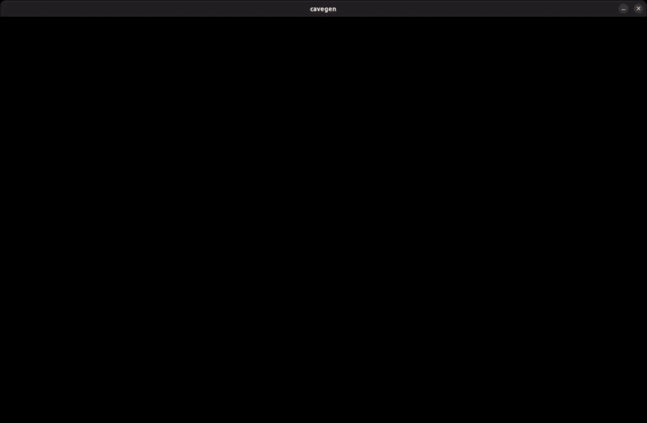

# Relazione progetto esame Algoritmi paralleli e sistemi distribuiti

## Alessio Farfaglia

[TOC]

## Introduzione

Mentre l'idea di fare un Automa cellulare che generasse una caverna mi è venuta da questo [video youtube](https://youtu.be/v7yyZZjF1z4), l'implementazione è del tutto personale.

## Progettazione Concettuale

L'esecuzione del programma può essere suddiviso in queste parti:

1. si carica la configurazione scelta dall'utente tramite file e/o argomenti
2. si crea una griglia di `cols` colonne e `rows` righe
3. si riempie pseudo-casualmente la griglia di  `0` o  `1`  *(in base se il numero generato supera una soglia impostata dall'utente)*
4. se si usano più thread, il **main-thread suddivide staticamente la griglia in delle sotto-griglie e le distribuisce**
5. *inizia il loop principale*
6. **si scambino le celle-halo** tra i thread vicini
7. per ogni cella della sotto-griglia si contano i vicini vivi e:
   1. se sono maggiori o uguali alla soglia superiore la cella diventa piena (`1`)
   2. se sono inferiori alla soglia inferiore la cella diventa vuota (`0`)
   3. altrimenti la cella resta invariata (`1` o `0`)
8. il **main-thread raccoglie tutte le sotto-griglie**
9. viene mostrata la mappa intera
10. se non si è raggiunta la generazione finale **si torna al punto 6**
11. *finisce il loop principale*
12. si mostrano informazioni sull'esecuzione
13. *il programma termina*

## Funzione di transizione

La funzione di transizione di questo automa pur non essendo particolarmente complessa, da vita a formazioni che ricordano quelle di una caverna.

la versione di base fa questo:

1. la cella conta le celle piene tra i suoi **8 vicini** ([vicinato di Moore](https://en.wikipedia.org/wiki/Moore_neighborhood))
2. se sono **più di 4**, la cella diventa **piena** (`1`)
3. se sono **meno di 4**, la cella diventa **vuota** (`0`)
4. altrimenti la cella resta invariata

Nel mio programma ho voluto mantenere il funzionamento di base, ma estendendolo a un raggio arbitrario, in particolare:

- nella versione di base 4 indica sia la metà del numero di vicini sia la soglia da superare per cambiare lo stato della cella

- nella mia versione la soglia è data dalla metà del numero dei vicini + la variabile `roughness`. (chiamata così perché all'aumentare di essa, la superficie della caverna diventa più frastagliata)

- il numero totale di vicini è dato dal raggio, la formula esatta è:  $vicini = (raggio * (raggio+1)) * 4$, ma è molto più intuitivo graficamente:

- da sinistra verso destra: raggio 1, raggio 2 e raggio 3

  

## Implementazione versione seriale

Si è voluto iniziare da una semplice versione seriale, qui ho implementato (dopo qualche difficoltà iniziale) un sistema di rendering sfruttando la libreria [allegro 5](https://liballeg.org/) e una prima versione di base del loop principale.

A questo punto tenendo in considerazione la questione performance ho preso la decisione di sfruttare il pre-processore di c per compilare solo la parte che mi interessava, in particolare se l'esecuzione fosse seriale o parallela e se mostrare la griglia oppure no.

Andando avanti con lo sviluppo questa decisione ha portato pochi pro e molti contro (codice difficile da gestire), quindi ho deciso di semplificare le cose utilizzando dei semplici `if`, a conti fatti l'impatto sulle prestazioni è stato impercettibile.

 Ogni cella quando deve contare i vicini pieni lo fa sfruttando quella che è la griglia di lettura, dopo di che lo stato della cella viene scritto sulla griglia di scrittura.

Quando tutte le celle hanno finito di aggiornarsi le griglie si scambiano di ruolo, quella di scrittura diventa di lettura e pronta per essere renderizzata, mentre quella di lettura diventa di scrittura, pronta per ospitare lo stato delle celle della prossima generazione.

## Parallelizzazione

### MPI Datatypes

### MPI Communicator

### Suddivisione Griglia

### Rendering

## Risultati benchmark
